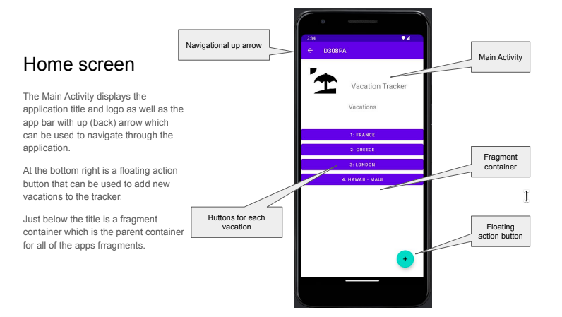
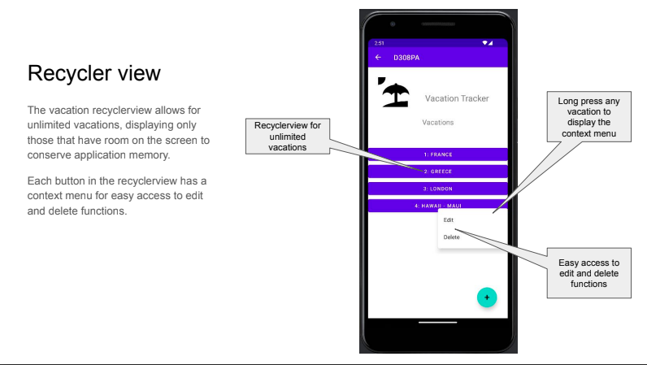
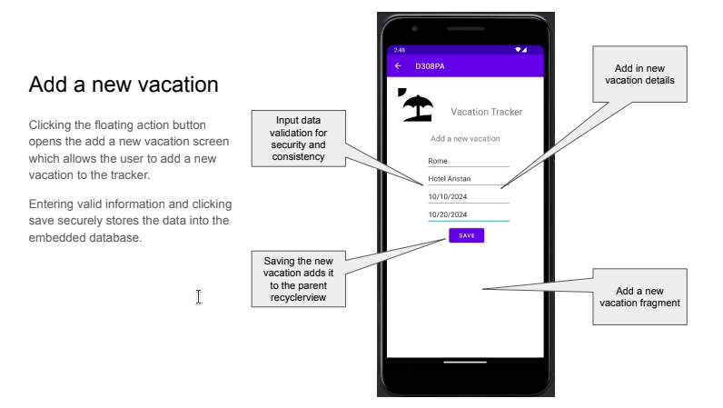
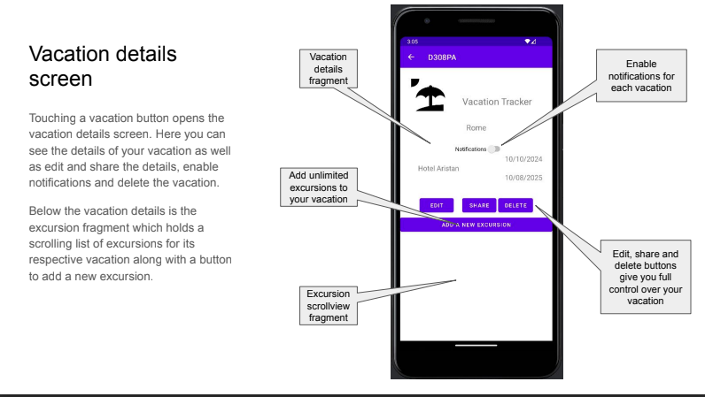

# Vacation Tracker Mobile Application
Java (8)
Compile SDK: 34
Target SDK: 33  
Minimum SDK 26

## About
The Vacation Tracker app is a final project for a Mobile Application Development (Android) course.

The apps purpose is to demonstrate the application of the technical programming skills acquired
throughout the course. The application was planned to resemble a real-world scenario using Android 
Studio, Java, Room framework and SQLite to build a basic vacation tracking application.

The app utilizes a number of features of the Android SDK including:
* Activities
* Fragments
* Intents
* Permissions
* Alerts
* Notifications
* ORM
* Database

## Usage
1. clone the repository
2. Run the app
  
After installing and launching the Vacation Tracker app you will land at the home page which will display
vacations as you add them.

### Add a vacation
Press the + floating action button in the bottom right
Enter the vacation information, all fields are required
Press SAVE to write your vacation to the database
Note - The start date must be prior to the end date

### View vacation details
Press a vacation entry button from the home page

### Edit a vacation
From the vacation details page, press the EDIT button
OR optionally, long press a vacation entry button from the home page and press EDIT
Make any necessary edits to the vacation details
Press SAVE to update your vacation in the database

### Share a vacation
From the vacation details page press the SHARE button
The Android share window will popup giving you sharing options
Note - Some starter sharing text is pre-populated

### Delete a vacation
From the vacation details screen, press the DELETE button
OR optionally, long press a vacation entry button from the home page and press DELETE
Confirm the delete by pressing YES
Note - A vacation can only be deleted if it has no attached excursions

### Add an excursion
From the appropriate vacation details screen press the ADD A NEW EXCURSION button
Enter a title and date
Press save to save the excursion to the database.
Note - The excursion will only show up for the associated vacation
Note - The excursion date must be during the associated vacation's time frame

### View excursion details
from the vacation details page, press the appropriate excursion
The excursion details page will now be displayed

### Edit an excursion
From the excursion details page, press EDIT
Or optionally, long press the excursion from the excursion page and press EDIT on the context menu
Make the necessary updates and press save
The updates will be saved to the database
Note - You cannot move an excursion from one vacation to another

### Delete an excursion
From the excursion details page, press DELETE
Or optionally, long press the excursion from the excursion page and press DELETE
Confirm the delete by pressing yes

### Set Notifications for vacation or excursion start/end times
From the vacation or excursion details screens press to toggle the notification switch
This will send an alert to your phone on the start date of your vacation or excursion and the end date of your vacation.

### Navigation
Navigation between the screens is provided by pressing on the resource required, the up arrow on the app bar or your phone's back button

